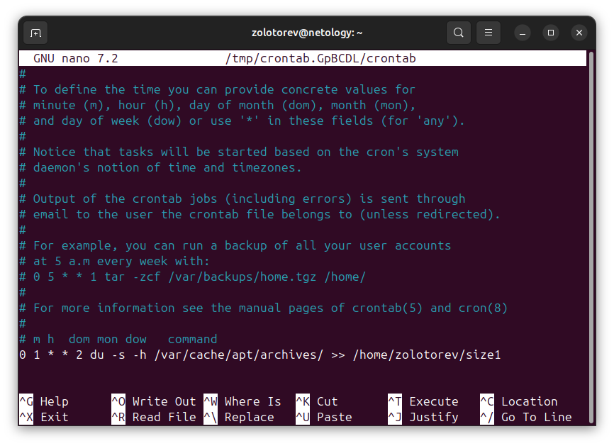

# Домашнее задание к занятию «Производительность системы. Часть 2»

### Золоторев Н.Д.

### Задание 1

Составьте задание через утилиту cron на проверку объёма кеш-обновлений еженедельно.

Кеш-обновления — это обновления, которые остаются после выполнения apt update, apt upgrade.

Приведите ответ в виде команды.

### Решение 1

### Задание 2

    Запустите процесс копирования большого файла (1 Гб) на жёсткий диск.
    Запустите команду iostat.
    Запустите iotop.

Какие процессы влияют на данные команды?

Приведите развёрнутый ответ и приложите снимки экрана.

### Решение 2

На данные команды влияют процессы чтения и записи.

### Задание 3

    Настройте приоритет использования swap в пропорции:

    30/70,
    50/50,
    70/30.

    Запустите браузер и нагрузите память:
       - сделайте скриншот терминала с выводом команды free -h;
       - открывайте закладки браузера, к примеру, Rutube;
       - мониторьте использование swap командой free -h;
       - при увеличении swap сделайте скриншот free -h;
       - продолжайте открывать закладки до близкого к полному исчерпанию оперативной памяти;
       - сделайте скриншот free -h;
       - сбросьте swap или перезагрузите машину;
       - повторите всё сначала в следующем режиме.

    Проанализируйте результат.

Приведите развёрнутый ответ и приложите снимки экрана.

### Решение 3

Чем выше приоритет SWAP, тем больше ядро перемещает информации в раздел подкачки. 
